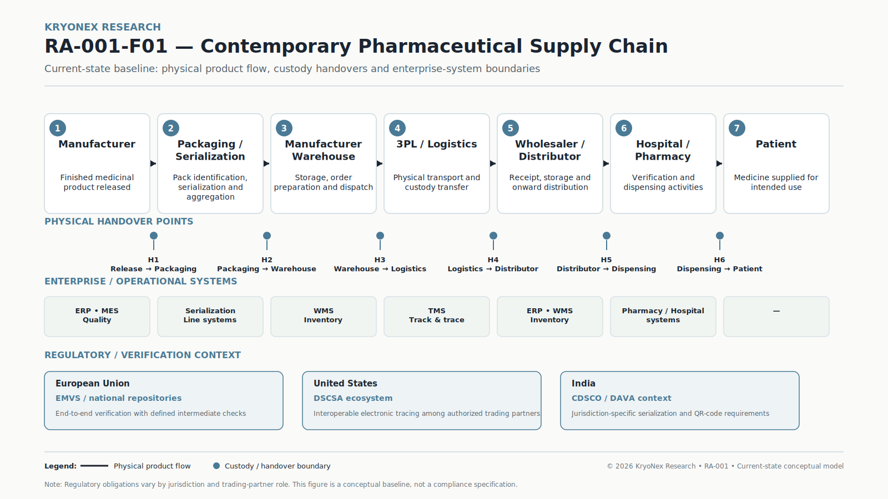
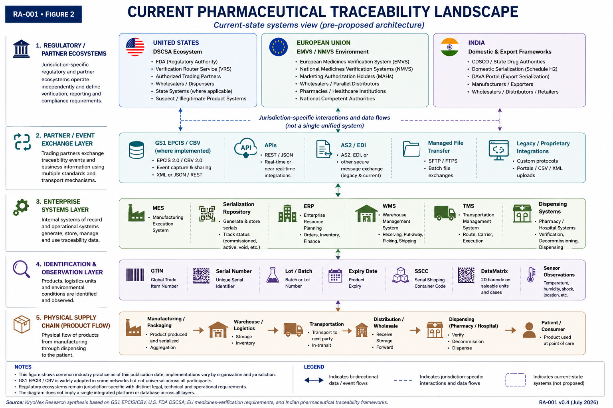

# Building Trust Across the Pharmaceutical Supply Chain

## A Reference Architecture for End-to-End Traceability

**RA-001 · Version 0.4 · Working Draft**

Prepared by **A. S. Tomar — KryoNex Research & Engineering Team**

**Status:** Under Technical Review  
**Last Updated:** 24 July 2026

> **Research status**
>
> RA-001 is a working reference architecture. It examines existing
> pharmaceutical traceability mechanisms and develops a vendor-neutral
> architectural model for connecting product identity, traceability events,
> environmental observations, enterprise systems and trust mechanisms across
> organizational boundaries.
>
> This version does not propose distributed-ledger technology, blockchain, IoT,
> or any other individual technology as a universal requirement.

---

## Executive Summary

Pharmaceutical traceability is not a single-system problem. A medicinal product
can pass through manufacturers, logistics providers, wholesalers, distributors,
pharmacies, hospitals, regulatory environments and other independently
operated organizations before reaching a patient. During that journey, physical
product movement must be associated with identifiers, serialization records,
business transactions, custody events, verification activities and, for some
products, environmental observations.

Significant infrastructure already exists. GS1 identification standards provide
globally recognized product and logistics identifiers. GS1 EPCIS and Core
Business Vocabulary (CBV) provide standards for sharing visibility-event data.
The United States, European Union, India and other jurisdictions operate
different regulatory and implementation models for pharmaceutical
serialization, verification and traceability.

The architectural challenge is therefore not simply to create another tracking
database. It is to understand how independently governed physical and digital
systems can exchange relevant evidence while preserving regulatory boundaries,
organizational control, interoperability, security and operational
performance.

RA-001 examines this problem from the point at which serialized pharmaceutical
packaging enters distribution through subsequent logistics and trading-partner
handovers toward dispensing. It separates six concerns that are frequently
collapsed into a single concept of "track and trace":

1. physical product movement.
2. product and logistics-unit identification.
3. traceability-event capture and exchange.
4. enterprise-system records.
5. environmental observations. and
6. identity, authorization and evidence validation across organizational
   boundaries.

The resulting reference architecture is deliberately vendor-neutral. Existing
regulatory repositories and enterprise systems remain authoritative within
their respective domains. Additional cryptographic credentials, signatures,
shared ledgers, or other trust mechanisms are considered optional architectural
patterns whose usefulness depends on the trust boundary being addressed.

The principal trade-off is therefore between stronger cross-organizational
verification and the additional governance, integration, latency, privacy and
operational complexity introduced by those mechanisms.

---

# 1. Why This Problem Matters

Medicines move through supply chains in which physical custody and digital
information are distributed across multiple organizations. Counterfeit,
falsified, diverted, stolen, improperly handled, or incorrectly represented
products can create consequences extending beyond conventional inventory loss:
the integrity of a pharmaceutical supply chain directly affects patient safety.

Counterfeiting is also part of a broader international illicit-trade problem.
OECD/EUIPO analysis has documented substantial international trade in
counterfeit and pirated goods and identifies pharmaceuticals among product
categories in which counterfeit goods can create significant health and safety
risks [11].

Pharmaceutical regulation has consequently moved progressively toward stronger
product identification and electronic verification. These initiatives have
created substantial traceability infrastructure, but the global environment is
not homogeneous.

A manufacturer may operate packaging-line serialization software and a
corporate serialization repository. A logistics provider may operate warehouse
and transportation systems. A wholesaler may receive EPCIS events. A pharmacy
may verify or decommission a serialized identifier. Regulators or industry
networks may operate separate verification or repository infrastructure.

Each system can be functioning correctly while cross-organizational visibility
remains incomplete.

The problem addressed by RA-001 is therefore:

> **How can pharmaceutical product identity, physical custody, traceability
> events, environmental evidence and independently governed digital systems
> be connected in a way that improves verifiability without replacing
> authoritative regulatory or enterprise systems?**

This question is intentionally broader than blockchain, IoT, serialization, or
any single technology.

---

# 2. Scope and Methodology

## 2.1 Research Scope

RA-001 focuses primarily on the pharmaceutical distribution lifecycle beginning
when packaged and serialized product becomes available for downstream
distribution.

The physical model includes:

- pharmaceutical manufacturer / packaging site.
- warehouse and dispatch operations.
- third-party logistics providers.
- distributors and wholesalers.
- pharmacies and healthcare dispensing environments and
- the final patient-facing handover.

The digital model considers:

- product identification and serialization.
- packaging aggregation.
- traceability-event generation.
- GS1 EPCIS and CBV.
- MES, serialization repositories, ERP, WMS and TMS.
- pharmacy and hospital dispensing systems.
- regulatory and trading-partner verification mechanisms.
- IoT and sensor observations where relevant. and
- mechanisms for validating identity, authorization, provenance and evidence.

## 2.2 Geographic Scope

RA-001 is globally oriented but uses three regulatory environments as major
reference points:

- United States.
- European Union and India.

These jurisdictions are not treated as having equivalent architectures.

The U.S. DSCSA environment, European medicines-verification environment and
Indian domestic/export traceability requirements have different legal,
technical and operational structures.

## 2.3 Research Method

RA-001 uses a systems-analysis approach rather than evaluating a specific
commercial platform.

Evidence is prioritized approximately as follows:

1. primary legislation, regulatory notifications and government guidance.
2. formal standards and specifications.
3. standards-body and industry implementation guidance.
4. peer-reviewed academic literature and
5. established technical and intergovernmental research.

Material factual and regulatory claims are mapped separately in the
`evidence-register.md` maintained with this publication.

## 2.4 Architectural Method

The architecture separates the problem into layers rather than beginning with a
preferred technology.

The analysis asks:

- Where is physical truth established?
- Where is product identity established?
- Which system creates each digital event?
- Which organization controls that system?
- Which information crosses organizational boundaries?
- Which participant is authorized to create, modify, verify, or consume it?
- What evidence links a digital record to a physical handover?
- Which records are legally or operationally authoritative?
- Where does verification depend on trust in another organization?
- Where could additional verification mechanisms create meaningful value?

This distinction is fundamental to RA-001.

## 2.5 Out of Scope

Version 0.4 does not attempt to:

- replace DSCSA, EMVS/NMVS, CDSCO, DAVA, or other regulatory infrastructure.
- define a new pharmaceutical serialization standard.
- prescribe a specific blockchain or distributed-ledger platform.
- prescribe a particular IoT vendor or device.
- claim that digital records alone establish physical authenticity.
- provide a production deployment blueprint for a specific organization.
- provide legal or regulatory advice or
- claim that one architecture applies unchanged across all jurisdictions.

---

# 3. Current Pharmaceutical Traceability Landscape

## What is pharmaceutical traceability?

For the purposes of RA-001, pharmaceutical traceability is the ability to
identify a medicinal product and reconstruct relevant events associated with
its movement and handling through the supply chain.

Effective traceability can involve several different forms of evidence:
serialized product identifiers, logistics-unit identifiers, business
transactions, event records, regulatory verification, custody changes and
environmental observations.

These records are not necessarily created or controlled by the same system.

---

## 3.1 Product Identification and Serialization

Pharmaceutical traceability begins with the ability to identify products and,
where required, individual saleable units.

GS1-based implementations can combine product identifiers with serial numbers,
batch or lot information and expiration information in machine-readable data
carriers such as 2D DataMatrix symbols.

Logistics hierarchies introduce another level of identity. Cases, pallets and
other logistics units can be assigned identifiers such as the Serial Shipping
Container Code (SSCC).

Aggregation can then establish parent-child associations between serialized
saleable units and higher packaging levels.

This distinction matters because:

> **product identity is not the same thing as custody history.**

A correctly serialized package establishes an identity reference. It does not,
by itself, prove every physical location, custody change, environmental
condition, or business transaction associated with that package.

---

## 3.2 Traceability Events and EPCIS

Identification becomes operationally useful when systems record what happened
to an identified object.

GS1 EPCIS provides a standardized model for visibility-event information.
Together with the GS1 Core Business Vocabulary, EPCIS can represent business
events and their context across supply-chain processes [2].

Depending on the implementation, relevant lifecycle activities can include:

- commissioning identifiers.
- aggregation and disaggregation.
- packing.
- shipping.
- receiving.
- transformation.
- dispensing or decommissioning and
- other business-process events.

EPCIS 2.0 extends the standards environment beyond legacy XML-centric
implementations. It supports JSON/JSON-LD representations, REST-oriented
interfaces and sensor-related data capabilities [2].

RA-001 therefore treats EPCIS as an important interoperability layer rather
than as a centralized pharmaceutical database.

An EPCIS event can answer questions such as:

- **what** objects were involved.
- **when** the event occurred.
- **where** it occurred and
- **why** the event occurred in a particular business context.

The reliability of the resulting history still depends on the systems and
organizations creating and exchanging those events.

---

## 3.3 Enterprise Systems

Traceability information is generated and consumed by several classes of
enterprise and operational systems.

### Manufacturing Execution Systems

MES and packaging-line systems coordinate manufacturing and packaging
operations and can participate in serialization workflows.

### Serialization Repositories

Serialization repositories maintain identifier states, packaging hierarchies,
commissioning information and related serialization records.

### Enterprise Resource Planning

ERP systems associate product movement with commercial and organizational
processes such as orders, invoices, customers and inventory accounting.

### Warehouse Management Systems

WMS platforms manage warehouse operations including receiving, put-away,
picking, packing and dispatch.

### Transportation Management Systems

TMS platforms coordinate shipment planning, carriers, routes and
transportation execution.

### Pharmacy and Hospital Systems

Endpoint systems can participate in verification, dispensing, decommissioning,
inventory management and patient-facing workflows depending on jurisdiction
and implementation.

No single one of these systems necessarily represents the complete
pharmaceutical journey.

The current landscape is therefore better understood as a **federation of
systems of record and operational systems** rather than one global tracking
platform.

---

## 3.4 Partner Data Exchange

Supply-chain visibility requires selected information to cross organizational
boundaries.

GS1 EPCIS/CBV provides a standards-based mechanism for representing and
exchanging visibility-event information. EPCIS 2.0 supports modern
representations and interfaces, while organizations may also continue to
operate legacy EPCIS environments or other partner-integration mechanisms [2].

Real implementations can therefore contain combinations of:

- EPCIS interfaces.
- XML-based exchanges.
- JSON/JSON-LD.
- REST APIs.
- AS2.
- managed file transfer.
- SFTP.
- message brokers.
- integration platforms and
- proprietary trading-partner APIs.

RA-001 does not assume that every participant operates EPCIS 2.0 natively.

### Legacy interoperability

Where organizations continue to operate EPCIS 1.2 or other legacy exchange
formats, implementations may require transformation or compatibility services
when integrating with EPCIS 2.0 environments.

Transformation introduces its own engineering questions:

- semantic preservation.
- schema-version management.
- event deduplication.
- identifier normalization.
- error handling.
- retry behavior and
- provenance of transformed records.

Interoperability therefore involves more than converting one payload syntax
into another.

---

## 3.5 Regulatory and Partner Architectures

Pharmaceutical traceability cannot be represented accurately as one global
regulatory model.

### 3.5.1 United States — DSCSA

The U.S. Drug Supply Chain Security Act establishes requirements intended to
enable electronic and interoperable identification and tracing of certain
prescription drugs as they move through the supply chain [1].

The DSCSA environment involves authorized trading partners, product
identifiers, transaction information, verification, investigation of suspect
and illegitimate product and interoperable electronic exchange.

Verification Router Service implementations have also emerged as
industry-developed mechanisms supporting product-identifier verification
workflows, including workflows associated with saleable returns.

VRS should not be interpreted as the U.S. equivalent of the European medicines
verification repository architecture. It is one mechanism within the broader
U.S. implementation ecosystem.

FDA has also provided phased exemptions and enforcement approaches during
DSCSA implementation. In particular, qualifying small dispensers and, where
applicable, their trading partners have exemptions from specified enhanced drug
distribution security requirements through November 27, 2026 [1].

RA-001 therefore treats DSCSA implementation state as time-sensitive regulatory
context rather than a static technical specification.

### 3.5.2 European Union — FMD / EMVS

The European pharmaceutical verification model follows a different
architecture.

The Falsified Medicines Directive and Delegated Regulation (EU) 2016/161
establish safety-feature and verification requirements for applicable medicinal
products [3].

The European Medicines Verification System operates through a European and
national repository structure. Manufacturers or marketing authorization
participants upload relevant product/serialization information, while
verification and decommissioning occur according to regulated workflows,
including at the dispensing endpoint and specified wholesaler scenarios.

The EU model is therefore primarily an **end-to-end medicines-authentication
model supplemented by defined verification activities**, rather than a
continuous replica of every logistics event occurring between manufacturer and
patient.

This distinction is important when comparing EMVS with EPCIS-based event
visibility.

### 3.5.3 India — Domestic and Export Traceability

India must also be treated as more than one serialization context.

Export-oriented pharmaceutical traceability has historically involved
requirements and infrastructure associated with the Drug Authentication and
Verification Application (DAVA) and related export serialization processes [5].

Domestic requirements are distinct.

In June 2026, Indian regulatory changes expanded Schedule H2-related barcode/QR
requirements for specified categories of medicines under the Drugs Rules [4].

The distinction between domestic requirements and export-oriented DAVA
processes should be preserved in architecture diagrams and implementation
analysis. Treating the two as one system can lead to incorrect assumptions
about data flow and regulatory responsibility.

For pharmaceutical manufacturing regions such as Gujarat, these requirements
also demonstrate why a traceability architecture may need to support multiple
regulatory contexts from the same manufacturing ecosystem.

---

## 3.6 Environmental Monitoring

Serialization establishes identity, but pharmaceutical integrity can also
depend on environmental conditions.

Temperature-sensitive medicines and biological products may be monitored using
devices such as:

- temperature data loggers.
- humidity sensors.
- active IoT sensors.
- location-aware monitoring devices and
- shock or handling sensors where appropriate.

Historically and operationally, environmental telemetry can reside in systems
separate from serialization and custody-event records. Data may be downloaded
from devices, retained by logistics providers, included in quality
documentation, or exposed through monitoring platforms.

This creates an architectural question:

> Can an organization reliably associate an environmental observation with the
> correct product, logistics unit, location, time interval and custody event?

EPCIS 2.0 provides standardized capabilities for incorporating sensor data into
visibility information, including information relevant to cold-chain
monitoring [2].

However, **standards capability must not be confused with universal industry
deployment**.

The existence of EPCIS sensor-data capabilities does not mean that all
pharmaceutical organizations currently correlate environmental telemetry with
custody events using EPCIS.

RA-001 therefore treats telemetry correlation as an architectural capability
whose implementation varies between organizations and supply chains.

---

# 4. Technical and Trust Challenges

The current landscape already provides significant product-identification,
serialization, event-exchange, enterprise and regulatory capabilities.

RA-001 does not assume these systems are failures.

Instead, it identifies challenges that emerge when evidence must cross
organizational and technological boundaries.

## 4.1 Fragmented System Authority

Different systems are authoritative for different facts.

For example:

- a packaging system may establish serialization state.
- a WMS may establish warehouse execution.
- a TMS may establish transportation activity.
- a sensor platform may record temperature.
- a trading partner may record receipt.
- a regulatory repository may establish verification state.

No single system necessarily has authority over all of them.

## 4.2 Digital Event vs. Physical Reality

A digital event stating that a product was received does not independently
prove that the physical item corresponding to the identifier was present.

Similarly, a valid barcode does not prove that the packaging carrying that
barcode has not been copied, diverted, substituted, or otherwise compromised.

Traceability architectures must therefore distinguish:

**identifier validity** from **physical authenticity**.

## 4.3 Custody Continuity

Physical custody changes can occur across independently operated organizations.

A traceability history is stronger when shipment, dispatch, receipt and
aggregation records can be correlated consistently, but gaps can occur when:

- identifiers are not captured.
- event data is delayed.
- partners use incompatible systems.
- aggregation relationships change.
- exceptions are handled manually or
- data remains within one participant's system.

## 4.4 Identity and Authorization

A technically valid message still raises questions:

- Who created it?
- Was that organization authorized to create that event?
- Was the sending system acting for the claimed organization?
- Has the message been altered?
- Is the credential or authorization still valid?

Transport security alone does not answer every organizational-trust question.

## 4.5 Environmental Evidence Correlation

Sensor data becomes substantially more useful when it can be correlated with:

- a product or logistics-unit identifier.
- a time interval.
- a physical location.
- a shipment.
- a custody holder and
- relevant traceability events.

Without reliable correlation, telemetry may establish that a sensor experienced
a condition without conclusively establishing which products were affected.

## 4.6 Cross-Jurisdictional Differences

Regulatory architectures differ.

A system designed around one jurisdiction's verification model cannot simply
assume identical responsibilities, repositories, events, or legal meanings in
another jurisdiction.

## 4.7 Legacy and Partner Integration

Pharmaceutical organizations cannot replace every enterprise and partner
system simultaneously.

Any practical architecture must therefore accommodate:

- legacy interfaces.
- asynchronous exchange.
- multiple schema versions.
- partial partner adoption.
- temporary network failures.
- retries.
- duplicate messages and
- differing organizational modernization timelines.

## 4.8 Data Governance and Confidentiality

Greater visibility is not automatically better.

Pharmaceutical and logistics information can reveal commercially sensitive
relationships, shipment volumes, locations, inventory positions, or other
information that participants may not be entitled to access.

A trust architecture must therefore answer not only:

> "Can this information be shared?"

but also:

> "Who needs this information, for what purpose and at what level of
> granularity?"

---

# 5. Reference Architecture

RA-001 develops the reference architecture incrementally.

The figures intentionally separate the physical supply chain from the digital
systems surrounding it. This prevents technology diagrams from obscuring where
the underlying evidence originates.

---

## 5.1 F01 — Contemporary Pharmaceutical Supply Chain

**Figure 1. Contemporary Pharmaceutical Supply Chain.**  
A conceptual physical-flow model from pharmaceutical packaging and
serialization through logistics, distribution, dispensing and the final
patient-facing handover.

**Source:** KryoNex Research synthesis. The figure represents an architectural
abstraction rather than the operating model of any single company or
jurisdiction.

F01 establishes the physical domain against which later digital evidence is
evaluated.

At each handover, different questions can arise:

| Physical stage | Relevant architectural questions |
|---|---|
| Packaging | Which identifier was commissioned and attached to the physical package? |
| Aggregation | Which serialized units belong to which case or pallet? |
| Dispatch | Which physical logistics unit left which controlled location? |
| Transportation | Who had custody and what environmental conditions were observed? |
| Receiving | Was the expected product physically received and recorded? |
| Distribution | Were aggregation and identity relationships preserved? |
| Dispensing | Was the identifier verified/decommissioned as required? |
| Patient handover | What product ultimately reached the endpoint? |

F01 does not claim that every supply chain contains exactly these actors or
handoffs. It establishes a common physical reference model for the subsequent
systems analysis.

---

## 5.2 F02 — Current Pharmaceutical Traceability Landscape

**Figure 2. Current Pharmaceutical Traceability Landscape.**  
A vendor-neutral systems view of the principal digital layers surrounding the
physical pharmaceutical supply chain, including product identification,
enterprise and edge systems, traceability-event interoperability,
trading-partner exchange, and jurisdiction-specific regulatory or partner
ecosystems.

**Source:** KryoNex Research synthesis derived from the RA-001 current-state
analysis and supporting standards and regulatory evidence.

F02 establishes that pharmaceutical traceability should not be treated as one
globally integrated technology stack.

Relevant information can be created, maintained, exchanged, or verified across
multiple independently governed environments, including:

1. product and logistics-unit identification;
2. serialization and aggregation systems;
3. MES, ERP, WMS, TMS, and serialization repositories;
4. GS1 EPCIS / CBV event exchange;
5. trading-partner interfaces and verification mechanisms;
6. dispensing and endpoint systems; and
7. jurisdiction-specific regulatory or partner ecosystems.

These components can interoperate while retaining separate ownership,
governance, authority, and system-of-record responsibilities.

The architectural significance of F02 is therefore not that existing
traceability infrastructure is absent. Substantial infrastructure already
exists.

The relevant question is where assurance must cross organizational, physical,
identity, observation, or system boundaries.

That question is examined in F03.

---

## 5.3 F03 — Trust and Visibility Boundaries

**Figure 3. Trust and Visibility Boundaries in Pharmaceutical Traceability.**  
A conceptual assurance model identifying transitions among physical products,
digital identities and observations, traceability records, independently
governed systems, trading partners, and external verification or regulatory
ecosystems.

**Source:** KryoNex Research architectural synthesis derived from the RA-001
current-state analysis and supporting standards and regulatory evidence.

F03 introduces an important distinction:

> **Boundary ≠ Failure**

A boundary identifies a transition at which assurance may depend on evidence,
controls, reconciliation, authorization, correlation, or governance. The
existence of a boundary does not itself demonstrate a control failure or
traceability weakness.

The analysis organizes cross-boundary assurance around four questions:

### Q1 — Product Identity

Is sufficient confidence established that the physical product corresponds to
the digital identifier being used?

Serialization can identify a package, but digital identity and physical reality
remain distinct domains.

### Q2 — Event Integrity

Can the origin, sequence, timing, and representation integrity of a digital
traceability event be assessed?

Integrity of a digital record should not be interpreted automatically as proof
that the represented physical-world event occurred exactly as recorded.

### Q3 — Organizational Authority

Can the participating organization be identified and can its relevant
authorization or status be evaluated for the applicable interaction?

Organizational identity, system authentication, regulatory status, and
transaction authorization are related but distinct concerns.

### Q4 — Observation Correlation

Can an environmental or logistics observation be associated with the relevant
product, logistics unit, event, location, time interval, or custody period at
the granularity required by the use case?

Sensor evidence becomes more useful when its relationship to traceability
identity and custody can be established.

F03 also highlights three recurring boundary patterns:

1. **Physical possession versus legal or transactional responsibility** —
   custody transfer and data-recording responsibility may occur on different
   timelines.

2. **Heterogeneous regulatory or implementation state** — participants may
   operate under different jurisdictional requirements, implementation
   timelines, or technical maturity.

3. **Endpoint verification and lifecycle closure** — some workflows require
   evidence of an appropriate terminal or lifecycle status.

F03 remains vendor-neutral and non-prescriptive. It does not establish
blockchain, distributed ledgers, credentials, or any other particular
technology as the required mechanism for resolving these boundaries.

The purpose of F03 is to establish which assurance requirements are sufficiently
supported by evidence to justify architectural mechanisms in F04.

---

## 5.4 F04 — Proposed Logical Reference Architecture

**Status: Under development.**

The current logical direction is:

    Regulatory / Partner Ecosystems
                  ↕
       Trust & Verification Layer
                  ↕
        Event Interoperability
                  ↕
      Enterprise & Edge Systems
                  ↕
     Identification & Sensing
                  ↕
          Physical Product

This model is intentionally logical rather than vendor-specific.

### Layer 1 — Physical Product and Handover

The physical layer represents medicinal products, packaging hierarchies,
shipments, custody transfers and dispensing activities.

Digital architecture ultimately depends on evidence generated from this layer.

### Layer 2 — Identification and Sensing

This layer can include:

- GTIN.
- serial number.
- batch/lot.
- expiration.
- SSCC.
- DataMatrix.
- RFID where used and
- environmental observations.

Its role is to connect physical objects and conditions with machine-readable
identity and observations.

### Layer 3 — Enterprise and Edge Systems

This layer includes operational systems such as:

- packaging-line systems.
- MES.
- serialization repositories.
- ERP.
- WMS.
- TMS.
- IoT gateways and
- dispensing systems.

These systems remain responsible for the business and operational processes
they control.

### Layer 4 — Event Interoperability

This layer provides normalized exchange of relevant traceability information.

GS1 EPCIS/CBV is the principal standards reference considered by RA-001 for
visibility-event interoperability.

Adapters may be required for legacy or proprietary systems.

### Layer 5 — Trust and Verification

This layer is not synonymous with blockchain.

Its purpose is to evaluate mechanisms for establishing:

- organizational identity.
- authorization.
- message integrity.
- evidence provenance.
- credential validity.
- tamper evidence and
- cross-organizational verification.

Possible mechanisms can include:

- conventional PKI.
- digital signatures.
- verifiable credentials.
- signed event envelopes.
- trusted directories.
- append-only audit structures.
- shared or distributed ledgers and
- combinations of these mechanisms.

The appropriate mechanism depends on the trust boundary.

### Layer 6 — Regulatory and Partner Ecosystems

The architecture must integrate with, rather than attempt to replace,
jurisdiction-specific and partner infrastructure.

Examples include:

- DSCSA trading-partner infrastructure.
- relevant product-identifier verification services.
- EMVS/NMVS.
- Indian regulatory systems and
- other authorized partner networks.

---

## 5.5 Architectural Principle: Evidence Before Technology

RA-001 follows one central design principle:

> **Do not introduce a trust technology until the evidence boundary requiring
> that technology has been identified.**

For example, if two systems are operated by the same organization under a
controlled security boundary, conventional authenticated APIs and audit
controls may be sufficient.

If independently governed organizations need to verify claims without granting
one participant unilateral authority over shared evidence, additional
cryptographic or distributed mechanisms may become relevant.

This prevents the architecture from treating blockchain, distributed ledgers,
verifiable credentials, or IoT as solutions in search of a problem.

---

## 5.6 Distributed Ledgers as an Optional Pattern

Distributed-ledger approaches to pharmaceutical traceability have been
investigated in peer-reviewed research [12].

Such approaches can provide architectural patterns involving shared
transaction histories, cryptographic integrity, smart contracts and
multi-party verification.

They also introduce trade-offs:

- additional infrastructure.
- consensus or transaction-processing overhead.
- key management.
- privacy considerations.
- governance complexity.
- integration with authoritative systems.
- data-correction mechanisms and
- questions about which information should or should not be placed on a shared
  ledger.

RA-001 therefore does **not** make distributed-ledger technology a prerequisite.

A ledger should be considered only where the identified trust boundary and
governance model justify its additional complexity.

---

# 6. Engineering Considerations

## 6.1 Integration Before Replacement

A realistic architecture should assume that existing MES, ERP, WMS,
serialization, regulatory and partner systems will remain in operation.

Integration boundaries should therefore be explicit.

Potential patterns include:

- APIs.
- event brokers.
- EPCIS repositories.
- adapters.
- integration gateways.
- asynchronous queues and
- controlled batch exchange.

The architecture should avoid requiring a synchronized global replacement of
existing systems.

## 6.2 Event Idempotency

Supply-chain event exchange must tolerate retries and duplicate delivery.

Systems should establish stable event identities or equivalent mechanisms that
allow receivers to distinguish:

- a legitimate retry.
- a duplicate event.
- a correction.
- a new event and
- a conflicting assertion.

## 6.3 Time

Cross-organizational event histories depend on time.

Implementations should consider:

- timestamp precision.
- time zones.
- clock synchronization.
- event occurrence time versus record time.
- delayed/offline event submission and
- correction of inaccurate timestamps.

## 6.4 Identity and Key Management

Cryptographic verification creates operational dependencies of its own.

Key and credential lifecycle management should address:

- issuance.
- storage.
- rotation.
- revocation.
- compromise.
- organizational changes.
- delegated authority and
- recovery.

Cryptography without lifecycle governance can create a different class of
traceability failure.

## 6.5 Security

Security should be applied at multiple layers.

Relevant controls can include:

- device authentication.
- service authentication.
- encryption in transit.
- encryption at rest.
- authorization.
- least-privilege access.
- signed messages where justified.
- audit logging.
- anomaly detection and
- segmentation between operational and enterprise environments.

## 6.6 Data Minimization

Cross-organizational traceability does not require every participant to receive
every field.

Architecture should distinguish between:

- data required for interoperability.
- evidence required for verification.
- commercially sensitive information.
- personal information.
- regulatory records and
- internal operational telemetry.

Selective disclosure or restricted access may be preferable to universal
replication.

## 6.7 Performance

Performance requirements vary substantially by workflow.

Packaging-line operations can have strict local timing requirements, while
partner event exchange or regulatory verification can operate under different
latency and throughput constraints.

RA-001 deliberately avoids claiming universal transaction-volume or
microsecond-response requirements.

Performance targets should be derived from:

- packaging-line throughput.
- event volumes.
- number of trading partners.
- verification workflow.
- network conditions.
- retention requirements and
- regulatory obligations.

## 6.8 Availability and Offline Operation

Physical logistics do not stop whenever a remote service becomes unavailable.

Implementations should therefore consider:

- local buffering.
- retry queues.
- offline capture.
- reconciliation.
- degraded operating modes.
- duplicate suppression and
- recovery after extended disconnection.

## 6.9 Computerized-System Validation

Where traceability components participate in regulated GxP processes,
computerized-system lifecycle and validation requirements must be evaluated in
the applicable organizational and regulatory context.

ISPE GAMP 5 provides an established risk-based industry approach to compliant
GxP computerized systems [15].

RA-001 does not represent GAMP 5 as a universal statutory mandate.

## 6.10 Cost Drivers

Major cost drivers can include:

- packaging-line integration.
- serialization infrastructure.
- partner onboarding.
- EPCIS repositories.
- integration middleware.
- sensors and gateways.
- network connectivity.
- security infrastructure.
- credential/key management.
- validation.
- monitoring.
- support.
- regulatory change and
- data retention.

A technically sophisticated trust mechanism that significantly increases
partner onboarding cost may reduce practical adoption.

Architecture decisions should therefore be evaluated against operational value,
not technical novelty.

---

# 7. Limitations

RA-001 has deliberate limitations.

## 7.1 Digital Traceability Cannot Guarantee Physical Authenticity

A cryptographically valid record can prove properties of a digital assertion.

It cannot independently prove that the physical medicine associated with that
assertion is genuine.

Physical anti-tamper controls, regulated packaging, inspection, quality
processes, enforcement and other controls remain necessary.

## 7.2 Garbage In, Verifiable Garbage Out

Tamper-resistant storage cannot make an incorrect observation true.

If a compromised device, malicious participant, incorrect scanner, or faulty
integration creates false data, stronger immutability may preserve the false
data more reliably.

Input trust remains a separate problem.

## 7.3 Regulatory Systems Remain Authoritative

The proposed logical architecture does not replace:

- FDA/DSCSA requirements.
- European medicines-verification infrastructure.
- CDSCO or other Indian regulatory systems.
- DAVA.
- national repositories or
- legally required organizational records.

Any production implementation must be mapped to the applicable legal
environment.

## 7.4 Jurisdictional Variation

The U.S., EU and Indian examples in RA-001 do not represent every
pharmaceutical market.

Additional jurisdictions can impose materially different serialization,
reporting, privacy, verification, retention, or data-localization requirements.

## 7.5 IoT Sensors Introduce Their Own Trust Boundary

Sensor data should not automatically be considered trustworthy because it is
digitally available.

Relevant considerations include:

- calibration.
- device identity.
- tamper resistance.
- battery state.
- placement.
- sampling frequency.
- connectivity.
- gateway integrity and
- chain of custody for the sensor itself.

## 7.6 Aggregation Is Not Permanently Static

Cases and pallets can be opened, repacked, disaggregated, or reaggregated.

Architectures that assume permanent parent-child relationships can produce
incorrect histories after legitimate logistics operations.

## 7.7 The Reference Architecture Is Not Yet Production Validated

RA-001 v0.4 is a research reference architecture.

It has not yet been validated as a complete production implementation across
multiple pharmaceutical trading partners.

F01 establishes the physical reference model, F02 documents the current
traceability landscape, and F03 establishes the trust and visibility boundary
model. F04 remains under technical development and has not yet been frozen.

---

# 8. Future Architectural Directions

This section describes possible architectural directions rather than
predictions of universal industry adoption.

## 8.1 Richer EPCIS 2.0 Integration

EPCIS 2.0 provides JSON/JSON-LD, REST-oriented interfaces and sensor-data
capabilities [2].

These capabilities can enable more developer-friendly event integration and
richer relationships between supply-chain events and environmental
observations.

Adoption will nevertheless depend on existing infrastructure, partner
readiness, regulation, cost and migration strategy.

## 8.2 Verifiable Organizational Identity

W3C Verifiable Credentials Data Model 2.0 became a W3C Recommendation in May
2025 [9].

Credential-based approaches may provide additional mechanisms for representing
organizational identity, authorization, or other machine-verifiable claims.

Whether such credentials are appropriate for a pharmaceutical workflow depends
on governance, trust anchors, revocation, interoperability and regulatory
acceptance.

## 8.3 Event and Sensor Correlation

Increasing correlation between product identity, logistics events and
environmental observations could improve investigation of cold-chain and
handling exceptions.

EPCIS 2.0 provides standards capabilities relevant to this model [2], but
implementation remains organization-specific.

## 8.4 Selective Cryptographic Verification

Not every traceability event needs a distributed ledger.

Future architectures may instead combine different trust mechanisms according
to boundary:

- authenticated APIs within controlled environments.
- signed messages between organizations.
- verifiable credentials for organizational claims.
- append-only evidence stores for audit.
- regulatory repositories for legally authoritative state and
- shared/distributed ledgers only where multi-party governance warrants them.

## 8.5 Stronger Physical-Digital Binding

One of the most difficult long-term problems is strengthening the relationship
between a physical object and its digital identity.

Possible approaches include combinations of:

- tamper-evident packaging.
- secure identifiers.
- RFID/NFC.
- device-assisted verification.
- optical or material signatures.
- sensor evidence and
- cryptographic mechanisms.

No single mechanism currently removes the need for layered physical and digital
controls.

---

# 9. Key Takeaways

- **Pharmaceutical traceability is a multi-system problem.** Product identity,
  enterprise records, logistics events, regulatory verification and physical
  custody are controlled by different systems and organizations.

- **Serialization is foundational but not equivalent to end-to-end trust.**
  A serialized identifier establishes machine-readable identity, additional
  evidence is required to reconstruct custody, handling and verification.

- **Existing standards should be treated as architecture foundations, not
  obstacles.** GS1 identifiers, EPCIS/CBV and jurisdiction-specific regulatory
  infrastructure already solve important parts of the problem.

- **Interoperability is primarily an organizational-boundary problem.** Open and
  widely adopted standards can reduce dependence on proprietary data models,
  but governance, authorization, semantics and evidence quality remain
  necessary.

- **IoT telemetry becomes more valuable when correlated with identity and
  custody.** Sensor data alone does not establish which pharmaceutical product
  experienced a particular environmental condition.

- **Distributed ledgers are an architectural option, not the starting
  assumption.** Their use should be justified by a specific multi-party trust
  or governance requirement.

- **Digital verification does not replace physical controls.** A trustworthy
  pharmaceutical supply chain requires both physical and digital evidence.

- **- **The next architectural question is which mechanisms are justified at each
  assurance boundary.** F01 establishes the physical domain, F02 maps the
  current systems landscape, and F03 identifies the assurance boundaries.
  F04 will evaluate which mechanisms, if any, can strengthen assurance across
  those boundaries without unnecessarily replacing existing authoritative
  systems.

---

# 10. References

> **Reference note:** Regulatory and standards references are maintained with
> claim-level verification in `sources/evidence-register.md`. Bibliographic
> details remain subject to final verification before RA-001 v1.0 publication.

[1] U.S. Food and Drug Administration (FDA), *Drug Supply Chain Security Act
(DSCSA)* implementation materials, including FDA exemptions from specified
enhanced drug-distribution-security requirements for eligible small dispensers
through 27 November 2026.

[2] GS1, *EPCIS Standard and Core Business Vocabulary (CBV), Version 2.0*,
including EPCIS 2.0 representation, REST-interface and sensor-data
capabilities.

[3] European Commission, *Commission Delegated Regulation (EU) 2016/161 of
2 October 2015 supplementing Directive 2001/83/EC by laying down detailed rules
for the safety features appearing on the packaging of medicinal products for
human use.*

[4] Government of India, Ministry of Health and Family Welfare / CDSCO,
*G.S.R. 506(E), Drugs Rules amendment concerning Schedule H2*, 22 June 2026.

[5] Government of India, pharmaceutical export traceability and Drug
Authentication and Verification Application (DAVA) implementation materials.

[6] World Health Organization, pharmaceutical supply-chain and product-quality
guidance relevant to distribution, traceability and falsified medical
products.

[7] W3C, *Decentralized Identifiers (DIDs) v1.0*, W3C Recommendation, 2022.

[8] W3C, *Verifiable Credentials Data Model v2.0*, W3C Recommendation,
15 May 2025.

[9] GS1 US, Verification Router Service (VRS) implementation materials and
industry guidance relevant to product-identifier verification workflows.

[10] GS1, *General Specifications*, provisions relevant to Global Trade Item
Numbers (GTIN), Serial Shipping Container Codes (SSCC), GS1 DataMatrix and
logistics-unit identification.

[11] OECD and European Union Intellectual Property Office (EUIPO), *Trends in
Trade in Counterfeit and Pirated Goods*, Illicit Trade, OECD Publishing,
Paris/EUIPO, Alicante, 2019.

[12] A. Musamih, K. Salah, R. Jayaraman, J. Arshad, M. Debe, Y. Al-Hammadi,
and S. Ellahham, "A Blockchain-Based Approach for Drug Traceability in
Healthcare Supply Chain," *IEEE Access*, vol. 9, pp. 9728-9743, 2021.
doi:10.1109/ACCESS.2021.3049920.

[13] ISO/IEC 15459 series, *Information technology — Automatic identification
and data capture techniques — Unique identification.*

[14] Open Credentialing Initiative (OCI), technical materials concerning
credential-based Authorized Trading Partner identity and verification
architectures.

[15] International Society for Pharmaceutical Engineering (ISPE), *GAMP 5:
A Risk-Based Approach to Compliant GxP Computerized Systems*, Second Edition,
2022.

[16] World Customs Organization (WCO), *Customs Risk Management Compendium*,
Volume 1, WCO, Brussels, 2020.

[17] GS1 US, DSCSA implementation and pharmaceutical traceability guidance.

[18] European medicines-verification implementation materials concerning the
European Medicines Verification System (EMVS), European Hub and National
Medicines Verification Systems (NMVS).

---

## Publication and Research Notice

RA-001 is an independent technical research publication developed by
**KryoNex Research**.

Standards, regulations, product names, organization names and technical
specifications referenced in this publication remain the property of their
respective organizations.

The diagrams, architectural synthesis, classifications, explanatory models,
and original analysis presented by KryoNex Research represent the authors'
interpretation of publicly documented standards, regulatory requirements,
technical literature and systems-engineering considerations.

Reference architectures are provided for informational and research purposes.
Implementation requirements vary by organization, jurisdiction, product class,
risk profile and regulatory environment.

This publication does not constitute legal, regulatory, medical, quality or
compliance advice.

**© 2026 KryoNex Research.**
